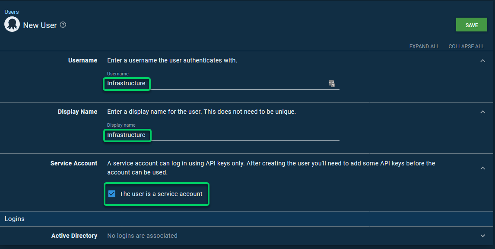
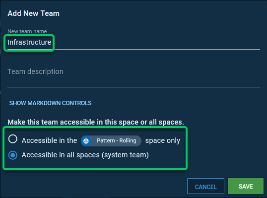
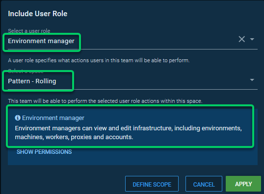
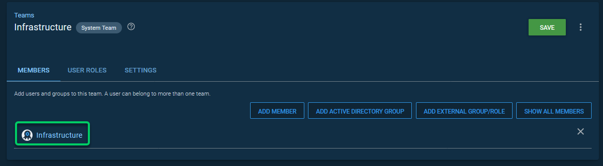
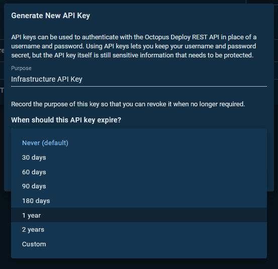
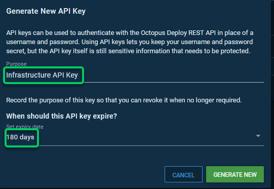
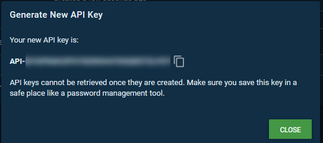

# AutomatingTentacle

This repository contains automation scripts to install and configure Octopus Tentacle on different Operating Systems.

## Networking

Each Operating System listed will have a polling and a listening tentacle option listed.

### Listening Tentacles/Workers

By default, Octopus uses port 10933 for a Listening Tentacle and Listening Workers. The Octopus server connects directly or via a Proxy to an endpoint listening on 10933. You will need to add Port 10933 to the inbound firewall rules to the server and allow the server to connect over a private or public network. This may involve opening a port on a hardware load balancer or firewall.

### Polling Tentacles/Workers

By default, the Octopus server listens on 10943 for Polling Tentacles/Workers connections, or whatever the default is when you set up Octopus. On the Polling Tentacles/Workers, you will need to connect to this port. This may involve allowing outbound connections on your local server/endpoint. Additionally, you may need to enable non-default outbound connections on 10943.

If you have a firewall blocking all traffic apart from Port 80/443, you may need to configure your server to listen using [websockets](https://octopus.com/docs/infrastructure/deployment-targets/windows-targets/polling-tentacles-web-sockets).

## Linux

- [Redhat, Fedora & CentOS 7 and 8](/Linux/Redhat)
- [Debian, Ubuntu, Mint, Kali](/Linux/Debian)
- [Archive](/Linux/Archive)

### Linux Public IP's and Hostnames

When registering Linux Targets and Workers, Octopus assumes that they are addressable using your local DNS. If you are dealing with public IPs or Hostnames, consider adding a  bash variable for the public IP or Hostname similar to **publicIp=$(curl -s https://ifconfig.info)**.

Using **[register-with](https://octopus.com/docs/octopus-rest-api/tentacle.exe-command-line/register-with.md)**, you can specify the IP or the public hostname.

Please be careful as your outbound IP may be different from your inbound IP, and it's worth getting this information and specifying it in environments you don't own.

### Additional Dependencies

This repo will not deal with additional dependencies required on your Linux or Windows Octopus Deployment targets. If you require .NET Core, for instance, then you will need to automate this or carry it out manually.

### Linux administrative commands

Every organization is different, and the examples provided here use [sudo](https://www.linux.com/tutorials/linux-101-introduction-sudo/). They are intended to demonstrate functionality. Ensure you comply with your company's security policies when you configure any user accounts and that your specific implementation matches your needs.

Some of the below will need Sudo access unless running from a secure shell.

## Windows

- Server 2012
- Server 2012 R2
- Server 2016
- Server 2019

You can check our [Operating System Compatibility](https://octopus.com/docs/support/compatibility#operating-system-compatibility) doc.

All of these use the same script, and you can see them [here](/Windows/Server)

### Windows Public IP's and Hostnames

When registering Windows Targets and Workers, Octopus assumes that they are addressable using your local DNS. If you are dealing with public IPs or Hostnames, consider adding a PowerShell variable for the public IP or Hostname similar to **$PublicIP = (Invoke-WebRequest myexternalip.com/raw).content**.

Using **[register-with](https://octopus.com/docs/octopus-rest-api/tentacle.exe-command-line/register-with.md)**, you can specify the IP or the public hostname.

Please be careful as your outbound IP may be different from your inbound IP, and it's worth getting this information and specifying it in environments you don't own.

### Windows administrative commands

Every organization is different, and the examples provided here use elevated PowerShell. They are intended to demonstrate functionality. Ensure you comply with your company's security policies when you configure any user accounts and that your specific implementation matches your needs.

For a complete list of required permissions on Windows for the Octopus Tentacle, please check [Running Tentacle under a specific user account](https://octopus.com/docs/infrastructure/deployment-targets/windows-targets/running-tentacle-under-a-specific-user-account)

## Registering Polling Tentacle & Workers on HA Nodes

If you are using Octopus High-Availability, and registering either a Polling Tentacle or Worker, you will need to do it to each node in your HA cluster. Please check out [Polling Tentacles with HA](https://octopus.com/docs/administration/high-availability/maintain/polling-tentacles-with-ha) as this explains the concept in full.

### Debian Single Node Example

We're going to assume that you're registering the below:

```bash
serverUrl="https://my-octopus"   # The url of your Octous server
serverCommsPort=10943            # The communication port the Octopus Server is listening on (10943 by default)
apiKey=""           # An Octopus Server api key with permission to add machines
spaceName="" # The name of the space to register the Tentacle in
name=$HOSTNAME      # The name of the Tentacle at is will appear in the Octopus portal
environment=""  # The environment to register the Tentacle in
role=""   # The role to assign to the Tentacle
configFilePath="/etc/octopus/default/tentacle-default.config"
applicationPath="/home/Octopus/Applications/"
```

#### Adding Octopus Repo, Key and Installing the Tentacle/Worker

```bash
apt-key adv --fetch-keys https://apt.octopus.com/public.key
add-apt-repository "deb https://apt.octopus.com/ stretch main"
apt-get update
apt-get install tentacle
```

#### Configure the Tentacle

```bash
/opt/octopus/tentacle/Tentacle create-instance --config "$configFilePath"
/opt/octopus/tentacle/Tentacle new-certificate --if-blank
/opt/octopus/tentacle/Tentacle configure --noListen True --reset-trust --app "$applicationPath"
echo "Registering the Tentacle $name with server $serverUrl in environment $environment with role $role"
/opt/octopus/tentacle/Tentacle register-with --server "$serverUrl" --apiKey "$apiKey" --space "$spaceName" --name "$name" --env "$environment" --role "$role" --comms-style "TentacleActive" --server-comms-port $serverCommsPort
/opt/octopus/tentacle/Tentacle service --install --start
```

### Debian HA Example

You would need to take the above and change it so that you can register it to **octo1** and **octo2**

```bash
server1Url="https:/octo1"   # The url of your Octous server
server2Url="https:/octo2"   # The url of your Octous server
serverCommsPort=10943            # The communication port the Octopus Server is listening on (10943 by default)
apiKey=""           # An Octopus Server api key with permission to add machines
spaceName="" # The name of the space to register the Tentacle in
name=$HOSTNAME      # The name of the Tentacle at is will appear in the Octopus portal
environment=""  # The environment to register the Tentacle in
role=""   # The role to assign to the Tentacle
configFilePath="/etc/octopus/default/tentacle-default.config"
applicationPath="/home/Octopus/Applications/"
```

#### Adding Octopus Repo, Key and Installing the Linux Tentacle/Worker

```bash
apt-key adv --fetch-keys https://apt.octopus.com/public.key
add-apt-repository "deb https://apt.octopus.com/ stretch main"
apt-get update
apt-get install tentacle
```

#### Configure the Linux Tentacle

```bash
/opt/octopus/tentacle/Tentacle create-instance --config "$configFilePath"
/opt/octopus/tentacle/Tentacle new-certificate --if-blank
/opt/octopus/tentacle/Tentacle configure --noListen True --reset-trust --app "$applicationPath"
echo "Registering the Tentacle $name with server $server1Url in environment $environment with role $role"
/opt/octopus/tentacle/Tentacle register-with --server "$server1Url" --apiKey "$apiKey" --space "$spaceName" --name "$name" --env "$environment" --role "$role" --comms-style "TentacleActive" --server-comms-port $serverCommsPort
echo "Registering the Tentacle $name with server $server2Url in environment $environment with role $role"
/opt/octopus/tentacle/Tentacle register-with --server "$server2Url" --apiKey "$apiKey" --space "$spaceName" --name "$name" --env "$environment" --role "$role" --comms-style "TentacleActive" --server-comms-port $serverCommsPort

/opt/octopus/tentacle/Tentacle service --install --start
```

## Running the scripts

You will need to run these scripts either by using a Configuration Management tool like [Chef](https://www.chef.io/solutions/configuration-management) or [Puppet](https://puppet.com/). Alternatively, these can be run directly from the server, whether it's Linux or Windows. Please note that these scripts will require administrative Powershell sessions or a Secure shell with Root access.

### Variables explained

For each of the scripts, you will require a few things:

- Server URL i.e [https://myoctopusurl.company.com](https://myoctopusurl.company.com)
- Server thumbprint - You can get this by going to Configuration -> Thumbprint.
- [An API key](https://octopus.com/docs/octopus-rest-api/how-to-create-an-api-key) - a Key used to authenticate with the Octopus Deploy API
- A Space name - This is the space you are adding to the Infrastructure to. If you don't specify a Space, it will be added to your [Default Space](https://octopus.com/docs/administration/spaces#managing-spaces)
- Name - This is the server name as it should appear in Octopus. i.e., Prod-Web2
- Environment - This is the environment you are adding the Infrastructure to. i.e Dev/Test/Production
- [Target Roles](https://octopus.com/docs/getting-started/best-practices/environments-and-deployment-targets-and-roles#roles) - A target role is a way to tag your Infrastructure. i.e., ProjectX-Web-Server
- Server Comms Port - This is only required for Polling Tentacles, and this is the port used to accept inbound connections from Polling Tentacles and Workers. The default is 10943.

### Adding an Infrastructure Service Account

It's advisable to provide an Infrastructure account in Octopus Deploy and grant the minimum number of permissions to add and update Infrastructure.

You may want an Infrastructure account that spans all Spaces, or you may wish to have Space Specific Infrastructure account that only has access to add and update Infrastructure in a single Space. We'd recommend deciding what is best, and you can browse [System and Space permissions doc](https://octopus.com/docs/security/users-and-teams/system-and-space-permissions) to help you decide.

To add the account in Octopus:

- Log in to Octopus with a privileged account
- Select Users
- Select Add Users
- Ensure the Service account box is ticked. This means the user can't log in to the UI of Octopus.



- Add **Infrastructure Team**. This is where you will choose whether it's a System or Space level Team.





- Add **Infrastructure Service Account** to the **Infrastructure Team**



### Generating an API Key

- Browse to Configuration -> Users
- Select the **Infrastructure Account**
- Select **New API Key**
- Input Purpose
- Select Expiry (Generally keep this as low as you can, and we generally don't recommend **Never**)





Copy the API Key and store it in a Password Manager or similar. I set this to expire in 180 days.



## Useful Links

This section is to provide valuable links for you to read to give additional context.

### Octopus

- [System and Space Permissions](https://octopus.com/docs/security/users-and-teams/system-and-space-permissions)
- [Infrastructure Docs](https://octopus.com/docs/infrastructure)
- [Polling Tentacle over Websocket](https://octopus.com/docs/infrastructure/deployment-targets/windows-targets/polling-tentacles-web-sockets)
- [Register-With](https://octopus.com/docs/octopus-rest-api/tentacle.exe-command-line/register-with.md)
- [Register-Worker](https://octopus.com/docs/octopus-rest-api/tentacle.exe-command-line/register-worker)
- [Compatibility](https://octopus.com/docs/support/compatibility#operating-system-compatibility)
- [Running a tentacle under a specific account](https://octopus.com/docs/infrastructure/deployment-targets/windows-targets/running-tentacle-under-a-specific-user-account)
- [Polling Tentacles with HA](https://octopus.com/docs/administration/high-availability/maintain/polling-tentacles-with-ha)
- [Creating an API key](https://octopus.com/docs/octopus-rest-api/how-to-create-an-api-key)
- [Managing Spaces](https://octopus.com/docs/administration/spaces#managing-spaces)
- [Target Roles](https://octopus.com/docs/getting-started/best-practices/environments-and-deployment-targets-and-roles#roles)
- [Windows Targets](https://octopus.com/docs/infrastructure/deployment-targets/windows-targets)
- [Linux Targets](https://octopus.com/docs/infrastructure/deployment-targets/linux)

### Chef

- [Octopus Deploy cookbook](https://supermarket.chef.io/cookbooks/octopus-deploy)

### Chocolatey

- [Installing Chocolatey](https://chocolatey.org/install)
- [Installing Octopus Tentacle](https://community.chocolatey.org/packages/OctopusDeploy.Tentacle)

### Puppet

- [OctopusDSC Puppet Module](https://forge.puppet.com/modules/dsc/octopusdsc/latest)
